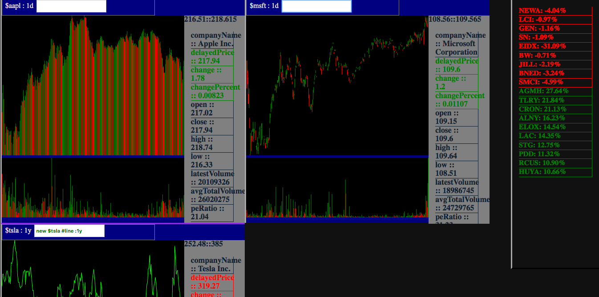

# iex has changed their api and this repo is no longer supported

# iex API Charts
### stock chart terminals in the browser

#### Data provided for free by [IEX](https://iextrading.com/developer). View [IEX's terms of use](https://iextrading.com/api-exhibit-a/) 
##### (no api key for api 1.0)

## Instructions:

1. Download or clone this repository
2. open "index.html" in your browser
3. enter commands into the input field

### Commands: 
(all commands are space separated, order is not important)

`help` - displays commands

`new` - opens a new terminal window with the same content as original, or new content if provided

`close` - closes the current terminal window

`!` - retrieves news

`$stock` - changes the current security

`:time` - [1d(default), 1m, 3m, 6m, ytd, 1y, 2y, 5y]

`#type` - chart type [bars, line, hiLo, (OHLC soon)]

`/searchTerm` - returns possible matches with ticker symbols

`lg | sm` - lg returns large graph, sm a smalll one(default)

#### example commands: 

`$goog :3m #hiLo` - produces a 3-month hiLo  chart of google

`:6m new` -produces a new 6-month hiLo chart of google

`#line new $msft :1y` - produces a 1-year line graph of microsoft in a new terminal window

## submit bugs! thanks
